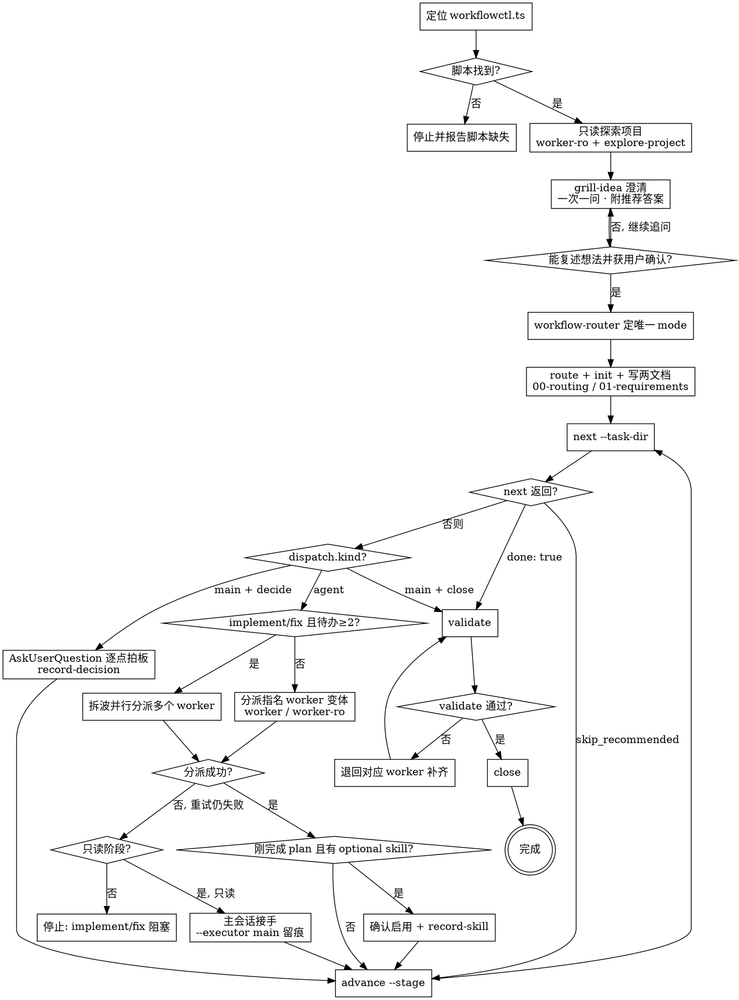

# xft-comat Pilot

使用本命令驱动 xft-comat 工作流。pilot 是工作流的**指挥者**，只做四件事：**探索项目 → 调用 grill-idea skill 还原用户想法 → 调用路由 skill 并 init → 循环向脚本要"下一个阶段 + 该分派的 worker 变体"，分派通用 worker，直到流程结束**。

执行模型是「**状态机定做什么，skill 定怎么做，worker 只管执行**」：阶段序列、每阶段该用哪个 worker 变体（`worker` 读写 / `worker-ro` 只读）、该读哪些方法论 skill、该给什么输入，全部由 `workflowctl.ts next` 返回；worker 是无领域角色的通用执行者，装载阶段 skill 后干活并自录。pilot **不需要知道路由之后有哪些阶段**，也**不写代码、不维护文档**：实质工作交给 worker 和脚本；worker 自己把产出和证据写回 `.xft-comat`。

用户请求如下：

```text
$ARGUMENTS
```

## 流程总览

下图是 pilot 的完整控制流。**方框 = 动作步骤，菱形 = 判定分支，双圈 = 工作流完成**。探索 / 澄清 / 路由都发生在 `init` 之前，不进入状态机；`init` 之后的 `next` 循环才是状态机本体，pilot 在循环里只做「要下一步 → 分派 worker → advance」。



## 前置检查

1. 定位工作流控制脚本，下文用 `<script>` 指代它的绝对路径。首选插件安装根目录：

```bash
node "${CLAUDE_PLUGIN_ROOT}/workflow/pilot/scripts/workflowctl.ts" --help
```

`CLAUDE_PLUGIN_ROOT` 不可用或上述路径不存在时，再尝试当前仓库内的 `workflow/pilot/scripts/workflowctl.ts`（仅在 xft-comat 仓库本体内开发时存在）。`.xft-comat` 始终写入当前项目，与脚本所在位置无关。

**两者都失败时立即停止，向用户报告脚本缺失并请求脚本路径。** 脚本缺失不构成任何降级理由：不得在主会话"模拟"工作流、不得自创 mode 或阶段序列、不得绕过脚本创建 `.xft-comat`、不得直接实现业务代码。下文"探索"一节的 fallback 只覆盖探索这一个动作，与脚本缺失无关。

2. 探索和最小必要澄清完成前，不要运行 `route`、`init`，也不要创建 `.xft-comat`。

## 执行顺序

### 1. 探索

分派 `worker-ro` agent 做只读项目探索：分派提示给出用户原始请求，并要求它先 `Read` 插件的 `skills/explore-project/SKILL.md`（路径用 `${CLAUDE_PLUGIN_ROOT}/skills/explore-project/SKILL.md` 拼出；此时尚无 task-dir，结果直接返回，不落库），得到技术栈、相关文件、现有测试、风险信号和"代码无法回答的问题"。当前运行时没有 agent 分派能力时，在主会话按同一 skill 做只读探索，并在 `00-routing.md` 记录 fallback。**该 fallback 仅限探索这一步**——它不允许跳过 workflowctl 流程，也不允许主会话接管后续任何实现/审查阶段。

### 2. 澄清（还原用户想法）

调用 `grill-idea` skill，用 grill 式访谈还原用户想法。**优先使用 AskUserQuestion 等运行时提问工具**（推荐答案设为第一个选项），工具不可用时降级为文本提问。核心机制：**一次只问一个问题**、每问附推荐答案、沿决策树按依赖顺序逐个解决（动机 → 期望成果 → 形态与行为 → 边界与例外 → 验收 → 路由信号）；能从代码探索得到答案时不转问用户。持续追问，直到能向用户**复述其想法并获确认**（共同理解），且足够支持路由。

### 3. 路由（init 之前完成，路由两文档由主会话经脚本落库）

调用 `workflow-router` skill 得出唯一的工作流 mode，然后：

```bash
node <script> route --task "<原始请求 + 澄清答案 + 显式假设>"
node <script> init --topic "<短主题>" --mode <mode> --summary "<澄清后的摘要>" [--ui true] [--runtime claude|codex]
node <script> set-doc --task-dir <task-dir> --doc 00-routing.md --stdin
node <script> set-doc --task-dir <task-dir> --doc 01-requirements.md --stdin
```

`00-routing.md` 必须说明 mode、类型判断、复杂度逐维度评分、澄清如何影响路由、是否涉及 UI/E2E。接收/探索/澄清/路由发生在 init 之前，不进入状态机；init 后 `current_stage` 直接落在第一个实质阶段，无需额外 advance。

这是 pilot 用 `set-doc` 写入的仅有两个文档（路由/需求决策产物，发生在 init 之前）。其余阶段文档由各阶段 worker 经 `submit` 自录；唯一例外是 decide 阶段的 `record-decision`（用户交互产物，见下）。

### 4. 阶段循环（不枚举阶段）

反复执行，直到 `next` 返回 `done: true`：

```bash
node <script> next --task-dir <task-dir>
```

按返回的 JSON 处理：

- **`done: true`** → 跳出循环，进入下方"收尾"。
- **`skip_recommended: true`**（fix 阶段，review 无阻塞发现）→ 直接 `advance --stage <advance_to>`，继续循环。
- **`dispatch.kind == "main"` 且 `stage == "decide"`** → 主会话读取设计文档的"待用户拍板的决策点"，**用 AskUserQuestion 逐个向用户拿到拍板结论**（每次一个决策，附推荐答案），然后：

```bash
node <script> record-decision --task-dir <task-dir> --stdin   # 抉择写入设计文档开头
node <script> advance --task-dir <task-dir> --stage <advance_to>
```

- **`dispatch.kind == "main"` 且 `stage == "close"`** → 执行下方"收尾"。
- **`dispatch.kind == "agent"`** → 分派 `dispatch.agent` 指名的 worker 变体（`worker` 读写 / `worker-ro` 只读）。分派提示保持精简，worker 会**自己跑 `next` 取完整分派包**（skill_paths、输入白名单、质量门禁、record_instructions），避免主会话转述丢字段；提示只需写明：
  - `script_path` 与 `task_dir`（worker 用它执行 `node <script> next --task-dir <task-dir>`）。
  - 当前 `stage` 与一句话任务背景（`inputs.summary` 即可）。
  - 分派成功、worker 完成自录后，执行 `advance --task-dir <task-dir> --stage <advance_to>`，回到循环。
  - 分派失败（工具报错、立即返回 0 tool uses 等）时如实向用户报告并重试一次；仍失败时：只读阶段（investigate/plan/review/final-verify）可由主会话按该阶段 skill 接手执行，并以 `--executor main` 加 `--reason "<失败原因>"` 自录（程序强制 main 必须留痕）；**implement/fix 不得由主会话接手写代码**，向用户说明阻塞并等待指示。证据必须反映真实执行者。

- **`dispatch.parallel == true`**（implement/fix 且待办实现任务 ≥ 2）→ **不要把整个阶段打包给一个 worker 长跑**，按 `dispatch.parallel_instructions` 拆波并发：
  - 按 `inputs.pending_tasks` 的 `deps` 分波：依赖均已 done（或无依赖）的任务为一波；文件范围重叠或共享同一测试入口的任务顺延到下一波。
  - 同一波内**每个任务分派一个独立的 `worker`**，在**同一条回复中并行发出多个 Task 调用**；每个 worker 只领一个任务 ID（一个测试点 + 最小实现的独立任务）。
  - 每个分派提示必须写明：`script_path` 与 `task_dir`、专属任务 ID/标题/文件范围、只动该范围、`submit` 加 `--append true` 追加自己小节、完成后 `set-task --id <任务ID> --status done --evidence "<证据>"`；其余细节 worker 自己从 `next` 分派包获取。
  - 一波全部 `set-task done` 后再发下一波（可重跑 `next` 刷新 `pending_tasks`）；**所有实现任务 done 后才 `advance`**。某个任务的 worker 失败时，单独重派该任务，不影响同波其他任务。

**plan 完成后、implement 开始前**：若 plan 产出建议了 optional/recommended skill，用 AskUserQuestion 向用户确认是否启用，确认结果用 `record-skill` 落库。required skill 在使用前由对应 worker 先验证可用：

```bash
node <script> skills check --require <skill>[,<skill>...]
```

主会话**不替 worker 跑** `submit`/`set-doc`/`record-skill`/`record-stage`/`add-task`/`set-task`/`check-test`/`record-review`（路由两文档、record-decision 与上述分派失败兜底除外）——这些由该阶段 worker 自己执行。`02-design.md` / `02-design-note.md` 由 plan/decide 维护；review/fix 产出写入 review 专用文档，不能覆盖设计文档。

### 5. 收尾

```bash
node <script> validate --task-dir <task-dir>
node <script> close --task-dir <task-dir>
```

如果验证失败，把缺失证据或流程缺口**退回对应阶段的 worker 补齐**，再复跑 `validate`/`close`。不要静默降级 required skill，也不要跳过 review/final-verify。

## 完成标准

只有满足以下条件，pilot 才算完成：

- 最终路由是在项目探索和想法澄清（grill-idea，用户已确认复述）之后创建的。
- 每个执行阶段都由 `next` 指名的 worker 变体完成，且该 worker 自己写回了文档与阶段执行记录（fix 被程序判定跳过、显式留痕的 main 兜底除外）。
- review 阶段用 `record-review` 落库了审查结论；有阻塞发现时 fix 实际闭环。
- 阶段 required skill 有真实证据，或有明确的 downgraded/blocked 记录。
- 所有结构化 implementation task 均已由 worker 用 `set-task --status done --evidence ...` 标记完成。
- 最新一轮测试用例已完成勾选。
- `close` 成功，且 `workflow.json` 的 `current_stage` 为 `"close"`、`next` 返回 `done: true`。

## 汇报内容

- 工作流 mode 和理由。
- 各阶段 worker 完成的代码/文档变更。
- 已运行的测试和 E2E 验证。
- `.xft-comat` 任务目录。
- 剩余风险或阻塞项。

## 后续建议

只建议能直接延续当前工作流的后续动作，例如启用缺失的 required skill、确认被阻塞的产品决策，或运行更完整的验证套件。
